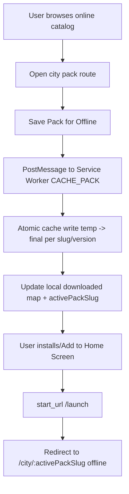

# Offline-First Architecture Plan

## Product Goal
Deliver city-specific travel packs that open **offline on first launch from home screen**, while keeping the full city catalog as an online-first browsing experience.

## Requirement Mapping

| Requirement | Architecture Decision |
| --- | --- |
| 1) Home screen launches selected city, not catalog | `start_url` set to `/launch`; launcher route redirects to `activePackSlug` |
| 2) New downloads must not be overwritten by old pack state | SW caches each pack in a slug/version-specific cache and updates only that slug |
| 3) First offline open must work immediately | SW install pre-caches app shell + mandatory city packs; no IndexedDB blocking first render |
| 4) Avoid duplicate config formats | `scripts/enforce-single-config-format.mjs` enforces canonical files |

## Offline Lifecycle

## Core Technical Decisions

1. Service worker strategy
- Workbox `injectManifest` for deterministic app-shell precache.
- `install` event pre-caches mandatory packs (`bangkok`, `istanbul`, `london`).
- `CACHE_PACK` message supports explicit per-pack caching from UI.

2. Atomic pack updates
- Each city pack is cached in `travel-pack-cache-<slug>-<version>`.
- Resources are downloaded into temporary cache first; only copied to final cache on full success.
- Older versions for the same slug are removed after successful commit.

3. Launch behavior
- Manifest `start_url` is `/launch`.
- `/launch` reads local active pack state and redirects immediately to `/city/:slug`.
- If no active pack exists, fallback goes to first mandatory slug.

4. Data architecture for scale
- City metadata index in `/public/content/packs/index.json`.
- City payload per slug in `/public/content/packs/<slug>.json`.
- Standardized pack schema lets you add cities without changing UI logic.

5. API and AI readiness
- Provider abstraction in `src/services/providers`:
  - `StaticPackProvider` (current baseline)
  - `ApiPackProvider` (future remote content)
- `PackRepository` uses online/offline fallback logic and can later merge AI-generated updates.

## File Scaffold

- `package.json`
- `vite.config.ts`
- `public/manifest.webmanifest`
- `public/content/packs/index.json`
- `public/content/packs/*.json`
- `src/sw.ts`
- `src/services/offlinePackService.ts`
- `src/services/providers/packProvider.ts`
- `src/services/providers/staticPackProvider.ts`
- `src/services/providers/apiPackProvider.ts`
- `src/services/packRepository.ts`
- `src/hooks/useOfflinePack.ts`
- `src/pages/HomePage.tsx`
- `src/pages/CityPackPage.tsx`
- `src/pages/LaunchPage.tsx`
- `scripts/enforce-single-config-format.mjs`

## Expand to 100+ Cities

1. Add new file: `/public/content/packs/<new-city>.json`
2. Add entry to `/public/content/packs/index.json`
3. Optional: include slug in `MANDATORY_PACK_SLUGS` if it must be pre-cached
4. No router/page/component changes required
